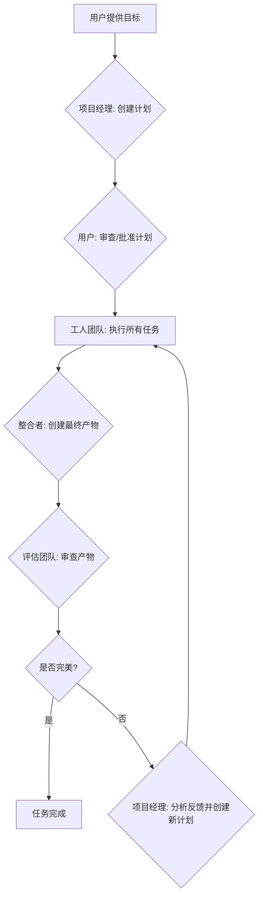
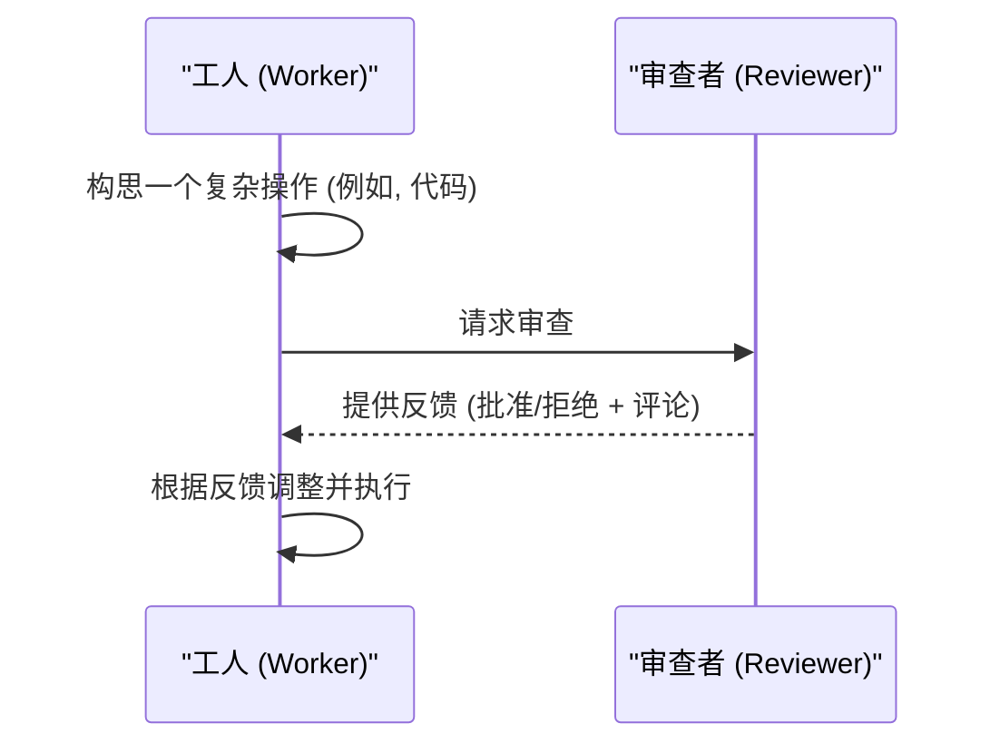

# 多智能体助手 (Multi-Agent Helper) v2.2

**一个具备规划、执行、反思和自我修正能力的VS Code多智能体开发框架。**

“多智能体助手”是一个功能强大的VS Code插件，它利用一个由专业AI智能体组成的团队，来自主地执行复杂的软件开发任务。基于用户提出的一个宏大目标，这个智能体团队能够进行规划、编写代码、使用文件系统和终端工具、评估自身工作，并进行迭代式的自我修正，直至任务完成。

---

## 核心理念

与传统的单个AI助手不同，本插件采用了一个**多智能体协作**的模式。每个智能体都有明确的角色和专长，它们通过一个中央消息总线进行通信、委派任务和互相审查工作，模拟了一个高效的软件开发团队。

---

## 🚀 如何开始 (Getting Started)

只需三步，即可开始您的第一个AI辅助开发任务。

### 第 1 步：安装插件

首先，请从本项目的 **[GitHub Releases](https://github.com/zhongruichen/build-agent/releases)** 页面下载最新的 `multi-agent-helper-x.x.x.vsix` 文件。

然后，您可以通过两种方式安装：

**A) 使用VS Code界面 (推荐)**

1.  打开 Visual Studio Code。
2.  进入 **插件** 视图 (`Ctrl+Shift+X`)。
3.  点击顶部的 **...** (更多操作) 按钮。
4.  选择 **从VSIX安装...**。
5.  选择您刚刚下载的 `.vsix` 文件并安装。
6.  重启VS Code以激活插件。

**B) 使用命令行**

在您的终端中，使用VS Code自带的 `code` 命令行工具。

```bash
code --install-extension multi-agent-helper-2.2.0.vsix
```

*(如果您需要从源码构建，请参阅 `INSTALL.md`)*

### 第 2 步：配置您的AI模型

首次使用时，插件将自动引导您完成配置。

1.  按下 `Ctrl/Cmd + Shift + P` 打开命令面板，输入并选择：**`开始多智能体任务`**。
2.  插件界面将在右侧打开，并显示 **配置向导**。
3.  点击 **"开始配置向导"** 并选择一个预设模板 (例如, **OpenAI GPT-4**)。
4.  点击 **"应用模板"**，在弹出的编辑器中填入您的 **API 密钥**。
5.  点击 **"保存"**。

### 第 3 步：运行您的第一个任务

1.  切换到 **"任务状态"** 标签页。
2.  在底部输入框中描述您的需求，例如：
    > "创建一个简单的HTML待办事项应用，支持添加和删除任务。"
3.  点击 **"发送"** 按钮。
4.  AI团队将开始规划、寻求您的批准，然后自主执行任务。您可以在UI界面上实时观察整个过程。

---

## 💡 常见用例 (Common Use Cases)

除了从零创建项目，您还可以用它来处理更复杂的开发任务：

### 用例 1：代码重构
> "请重构当前项目中的用户认证模块，要求：1. 提取重复代码；2. 改善错误处理；3. 添加单元测试；4. 更新相关文档。"

### 用例 2：Bug修复
> "项目中的搜索功能有问题：1. 搜索结果不准确；2. 中文搜索无效。请定位并修复这些问题，并解释根本原因。"

### 用例 3：添加新功能
> "为现有的博客应用添加一个评论系统。需要后端API端点、前端UI组件，并确保与现有认证系统集成。"

##  王牌特性

### ⭐ 可配置的深度思考链
为了从根本上提升AI的规划能力，我们引入了一套强大的 **15步深度思考流程**。在执行任何复杂任务前，AI团队的核心会像人类专家一样，进行一场深入的“头脑风暴”，全方位地分析问题、预判障碍、构思多种方案并进行自我批判。

- **专业思考，极致规划**: 告别简单的任务分解。AI能够进行第一性原理分析、苏格拉底诘问等高级思考，制定出更具远见、更鲁棒的执行计划。
- **完全透明的过程**: 您可以在UI界面上实时查看AI完整的15步思考过程，彻底告别“黑盒”。
- **精细化控制**: 您可以为每个模型定制不同的思考预设（默认、深度、顶级），或自定义详细参数，对AI的思考方式拥有前所未有的控制力。

### 🚀 提示词工程 v2.0
我们对所有核心智能体的提示词进行了系统性的深度优化。通过引入结构化模板和智能决策框架，智能体团队的协作更高效，任务执行更可靠，失败率显著降低。
想深入了解技术细节？请查看 **[提示词优化分析报告](PROMPT_OPTIMIZATION_REPORT.md)**。

---

## ✨ 主要功能一览

### 智能与自主
- **迭代式自我精炼**: 在“执行-评估-反思”循环中工作，不断提交、批判和优化成果。
- **动态任务委派**: 智能体可以动态创建新任务并委派给更适合的伙伴。
- **自我修正**: 当操作失败时，“反思者”会介入，分析原因并提供修正方案。
- **内部代码审查**: 在执行前，计划可被发送给“审查者”进行预先审查，提前发现问题。
- **长期记忆**: 具备知识库，可提取并复用跨任务的经验教训。

### 控制与配置
- **完全可配置的角色**: 通过UI自定义每个角色的系统提示、AI模型和可用工具。
- **灵活的API管理**: 轻松添加、管理和切换多个API服务商（OpenAI, Anthropic, Google, 本地代理等）。
- **精细化模型参数**: 为每个模型配置专属的 `temperature`, `max_tokens` 等参数。
- **交互式计划审查**: 在任务开始前，审查、修改甚至拒绝AI生成的计划。
- **“自动模式”**: 启用后将跳过所有用户批准步骤（如终端命令执行），适用于您完全信任AI的场景，实现真正的“一键式”自动化。
- **任务持久化**: 任务状态会自动保存。如果VS Code在任务中途关闭，下次启动时会询问您是否从断点处继续执行。
- **智能扫描 vs 深度扫描**: 您可以选择AI分析项目的深度。**智能扫描**只看文件名和目录结构，速度快；**深度扫描**会读取并总结每个文件的内容，上下文更完整但耗时更长。
- **并行执行**: 插件能自动识别计划中没有依赖关系的任务，并同时执行它们，显著缩短复杂任务的执行时间。

### 集成与工具
- **深度工作区感知**: 可选择“智能扫描”（仅文件结构）或“深度扫描”（AI总结每个文件）来提供项目上下文。
- **Git工具集**: 智能体可自主执行创建分支、暂存、提交等Git操作。
- **VS Code调试器集成**: 智能体可直接与调试器交互，设置断点、控制执行流程。
- **丰富的工具箱**: 包括文件系统、终端命令执行和网络搜索等能力。

---

## 工作原理 (How It Works)

本插件通过一个迭代式的“规划-执行-评估”循环来工作，并通过智能体之间的即时协作来预防和修复错误。

### 核心执行循环


### 智能体协作模式

---

## 认识智能体团队

- **项目经理 (Orchestrator)**: 任务的总规划师，负责分解目标和制定计划。
- **工人 (Worker)**: 计划的执行者，使用工具完成具体任务。
- **审查者 (Reviewer)**: 代码质量的把关人，在执行前审查计划。
- **反思者 (Reflector)**: 失败分析专家，分析错误并给出修正方案。
- **整合者 (Synthesizer)**: 最终产物的构建者，整合所有结果。
- **评估团队 (Evaluator Team)**: 质量保证（QA）团队，对产物进行打分和批判。
- **评论聚合者 (Critique Aggregator)**: QA团队领导，汇总反馈并给出最终分数。
- **知识提取者 (Knowledge Extractor)**: 团队知识管理员，负责长期记忆。

---

## 📚 详细文档

- **深入了解所有功能?** 查看 [**USAGE_GUIDE.md (使用指南)**](USAGE_GUIDE.md)
- **遇到问题?** 查看 [**FAQ.md (常见问题)**](FAQ.md)

---

## 🛠️ 技术栈 (Tech Stack)

- **框架**: Visual Studio Code Extension API
- **语言**: JavaScript (Node.js)
- **UI**: HTML, CSS, JavaScript (Webview)
- **核心依赖**:
    - `@vscode/webview-ui-toolkit`: 用于构建与VS Code风格一致的UI界面。
    - `axios`: 用于与各大LLM服务商进行API通信。
    - `showdown`: 用于将Markdown实时转换为HTML在UI中显示。
    - `mermaid`: 用于渲染流程图和序列图。

---

## 🤝 如何贡献 (Contributing)

我们欢迎任何形式的贡献！无论是报告Bug、提出功能建议，还是直接提交代码。

1.  **Fork** 本仓库
2.  创建您的特性分支 (`git checkout -b feature/AmazingFeature`)
3.  提交您的更改 (`git commit -m 'Add some AmazingFeature'`)
4.  推送到分支 (`git push origin feature/AmazingFeature`)
5.  打开一个 Pull Request

在提交代码前，请确保您已阅读并遵守项目的编码规范。
