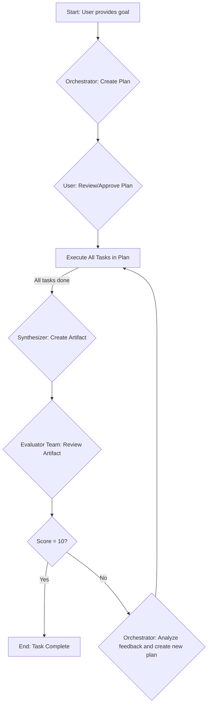
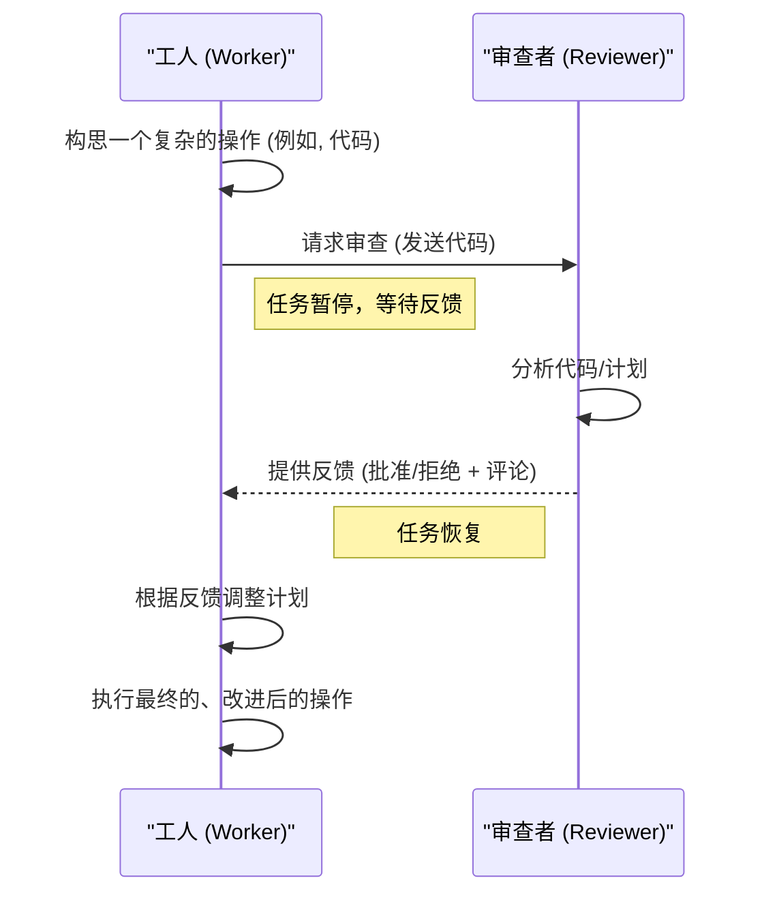

# 多智能体助手 (Multi-Agent Helper) v2.2

**一个具备规划、执行、反思和自我修正能力的VS Code多智能体开发框架。**

“多智能体助手”是一个功能强大的VS Code插件，它利用一个由专业AI智能体组成的团队，来自主地执行复杂的软件开发任务。基于用户提出的一个宏大目标，这个智能体团队能够进行规划、编写代码、使用文件系统和终端工具、评估自身工作，并进行迭代式的自我修正，直至任务完成。

---

## 核心理念

与传统的单个AI助手不同，本插件采用了一个**多智能体协作**的模式。每个智能体都有明确的角色和专长，它们通过一个中央消息总线进行通信、委派任务和互相审查工作，模拟了一个高效的软件开发团队。

---

## 工作原理 (How It Works)

本插件的工作流程可以被概括为几个核心循环和交互模式。

### 核心执行循环

插件的主要工作流程是一个迭代式的“规划-执行-评估”循环，旨在通过不断的反馈来逐步求精，直至达到完美的结果。

1.  **规划 (Plan)**: 用户提供一个总体目标后，**项目经理 (Orchestrator)** 会进行分析，并将其分解为一系列具体的、可执行的子任务计划。
2.  **执行 (Execute)**: **工人 (Worker)** 智能体按照计划，使用文件系统、终端、Git、调试器等工具来逐一完成子任务。
3.  **评估 (Evaluate)**: 当一轮任务完成后，**整合者 (Synthesizer)** 会将所有结果整合成最终产物。随后，**评估团队 (Evaluator Team)** 会对产物进行严格的打分和批判。
4.  **反思与迭代 (Reflect & Iterate)**: 如果产物未达到满分，**项目经理**会分析评估反馈，并制定出新一轮的、旨在解决这些问题的优化计划，从而开始下一次迭代。

### 智能体协作模式

为了提高效率和准确性，智能体之间还存在更小型的、即时的协作循环。

- **失败-反思循环**: 当一个**工人**在执行任务时出错（例如，命令失败），**反思者 (Reflector)** 会被激活。它会分析错误信息，找出根本原因，并为工人提供一个修正后的、更可能成功的下一步指令。
- **预执行审查循环**: 当一个**工人**将要执行一个复杂或关键的操作时（例如，编写一大段代码），它可以选择先不执行，而是将它的计划发送给**审查者 (Reviewer)**。审查者会像人类代码审查一样提供反馈，工人会根据这些反馈调整其计划，然后再执行，从而在早期预防错误。

---

## 主要特性

### 智能与自主

- **迭代式自我精炼**: 智能体团队在一个“执行-评估-反思”的循环中工作。它们会提交初步成果，然后由评估者角色进行打分和批判，再由规划者根据反馈制定下一轮的优化计划。
- **动态任务委派**: 在执行任务时，一个智能体可以动态地创建新任务并委派给另一个更适合的智能体，实现了灵活的即时规划。
- **自我修正**: 当一个操作（如执行终端命令）失败时，“反思者”智能体会介入，分析失败的根本原因，并为“工人”智能体提供一个修正后的、可行的下一步行动。
- **内部代码审查**: 在执行复杂操作前，“工人”智能体可以将其计划（如将要写入的代码）发送给“审查者”智能体进行预先审查，从而在早期发现并修复潜在问题。
- **长期记忆**: 插件具备一个知识库，可以在任务完成后提取可复用的经验教训（例如，“在此项目中，使用`npm run build`命令进行构建”），并在未来的任务中利用这些知识。

### 控制与配置

- **完全可配置的角色**: 您可以通过设置UI完全自定义每个智能体角色——修改它们的系统提示、分配特定的AI模型，甚至精确控制它们被授权使用的工具。
- **模型管理**: 在设置中轻松添加和管理多个来自不同供应商（OpenAI, Anthropic, Google等）的语言模型。
- **交互式计划审查**: 在任务开始前，您可以在UI中审查、修改甚至拒绝AI生成的计划，确保任务执行符合您的意愿。
- **“自动模式”**: 对于可信的任务，您可以启用“自动模式”，该模式将跳过所有用户批准步骤（如终端命令执行、迭代继续），实现真正的“一键式”自动化。
- **任务持久化**: 如果VS Code在任务中途关闭，插件会自动保存当前状态，并在下次启动时询问您是否要从断点处继续执行。

### 集成与工具

- **深度工作区感知**: 可选择“智能扫描”（仅文件结构）或“深度扫描”（AI总结每个文件），为AI提供完整的项目上下文。
- **Git工具集**: 智能体被授予了一套完整的Git工具，可以自主地创建分支、暂存文件、提交更改等。
- **VS Code调试器集成**: 智能体可以直接与VS Code的调试器交互，能够启动调试会话、设置/移除断点、控制执行流程（下一步、步入、继续）以及在断点处评估表达式。
- **丰富的工具箱**: 除了核心的Git和调试器工具，还包括文件系统操作、终端命令执行和网络搜索等能力。

---

## 认识智能体团队

- **项目经理 (Orchestrator)**: 任务的总规划师。它将用户的宏大目标分解为详细的、带依赖关系的子任务计划。
- **工人 (Worker)**: 计划的执行者。它使用工具箱来执行单个子任务，如读写文件、运行命令。
- **审查者 (Reviewer)**: 代码质量的把关人。在“工人”执行复杂操作前对其计划进行审查和批判。
- **反思者 (Reflector)**: 失败分析专家。当任务失败时，它会分析错误原因并给出修正方案。
- **整合者 (Synthesizer)**: 最终产物的构建者。在一轮迭代的所有任务完成后，它会整合所有结果，生成最终的完整代码或报告。
- **评估团队 (Evaluator Team)**: 质量保证（QA）团队。可以配置多个评估者，它们会从不同角度对最终产物进行打分并提出改进建议。
- **评论聚合者 (Critique Aggregator)**: QA团队的领导。它汇总所有评估者的反馈，给出一个最终的、统一的分数和总结。
- **知识提取者 (Knowledge Extractor)**: 团队的知识管理员。在任务结束后，它会总结经验教训并存入长期记忆库。

---

## 如何开始

1.  **安装插件:** 请遵循 [**INSTALL.md (安装指南)**](INSTALL.md)。
2.  **配置与使用:** 请阅读 [**USAGE_GUIDE.md (使用指南)**](USAGE_GUIDE.md) 来配置您的AI模型并开始您的第一个任务。
